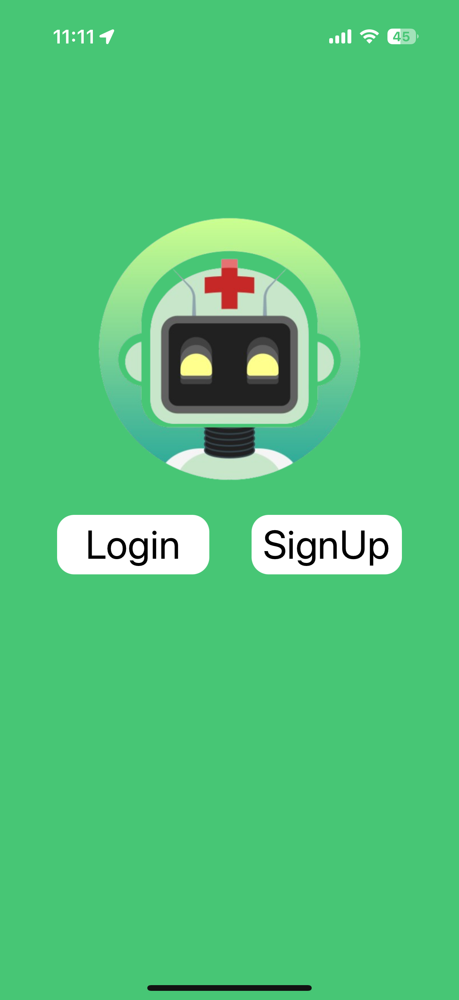

# VitAl_backend
헬스메이트(HealthMate) 🏋️‍♂️🤖

  
  
<i>AI 기반 개인 맞춤형 건강 관리 솔루션</i>

📱 프로젝트 소개
헬스메이트는 사용자의 신체 상태와 목표에 맞춘 맞춤형 운동 및 식단 관리를 제공하는 모바일 애플리케이션입니다. AI 기술을 활용해 사용자의 체형 분석, 운동 추천, 식단 관리 서비스를 제공합니다.
주요 기능

🔍 AI 체형 분석: 벤치프레스 자세 분석 및 개선 추천
📊 개인 맞춤 식단 추천: 사용자의 목표(근육증가/체중감량)에 맞는 식단 제공
📈 체성분 변화 트래킹: 시각적 그래프를 통한 진행 상황 모니터링
🏋️ 운동 부위 선택 기능: 맞춤형 운동 루틴 구성

📸 스크린샷
