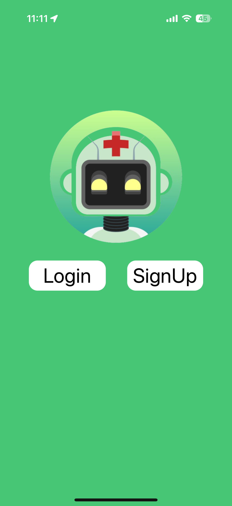
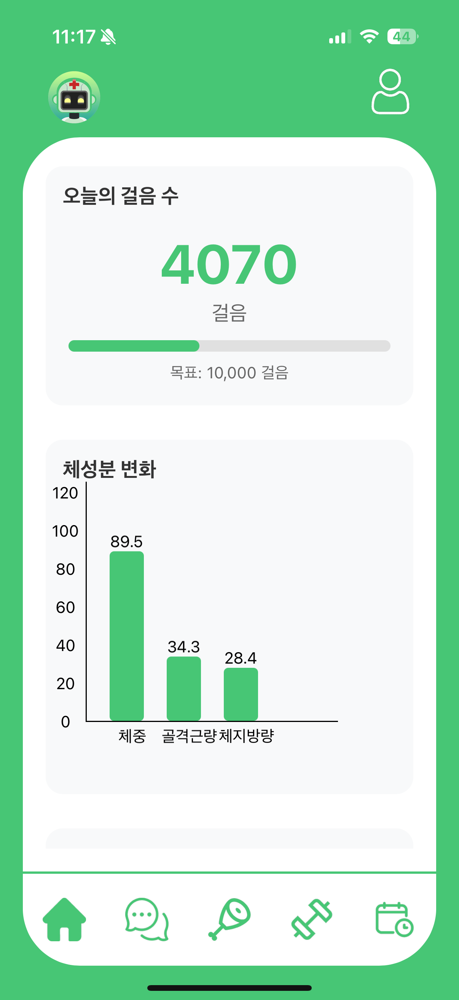
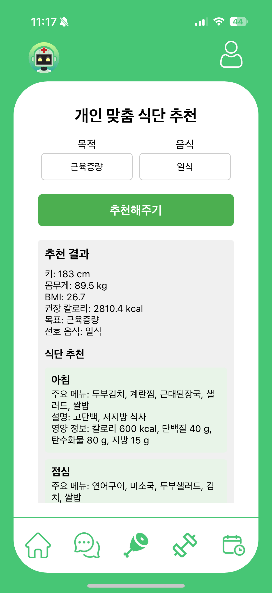
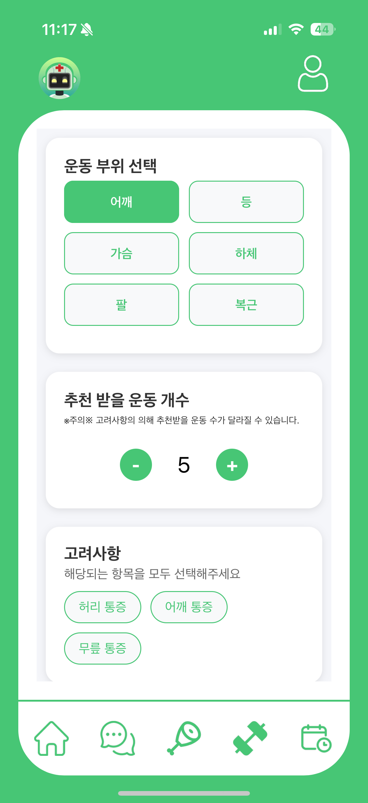
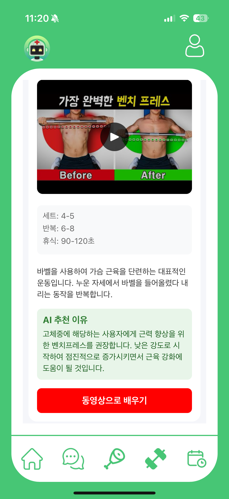
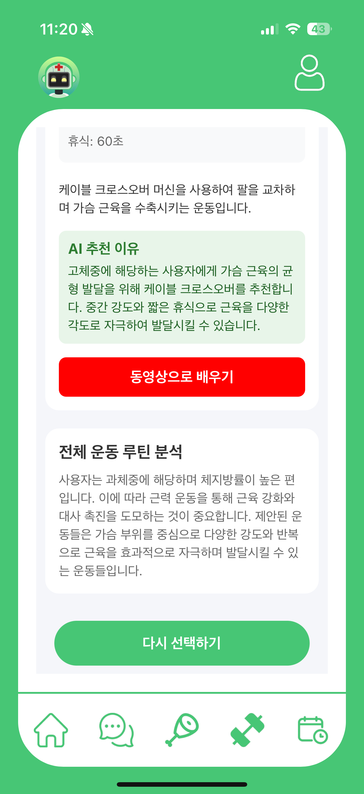

# VitAl - AI 기반 개인 맞춤형 건강 관리 플랫폼

> 사용자의 신체 상태와 목표에 맞춘 스마트 운동 & 식단 관리 시스템

[](https://spring.io/projects/spring-boot)
[](https://reactnative.dev/)
[](https://www.mysql.com/)

---

## 📖 Overview

### 해결하고자 한 문제
운동을 시작하는 많은 사람들이 **자신에게 맞는 운동 방법**과 **적절한 식단**을 찾는 데 어려움을 겪습니다. 개인 트레이너나 영양사를 고용하기에는 비용 부담이 크고, 인터넷의 일반적인 정보는 개인의 체형과 목표를 반영하지 못합니다.

### 핵심 가치
- **AI 체형 분석**: Gemini API를 활용한 벤치프레스 자세 분석 및 개선 추천
- **개인 맞춤 식단**: BMI, 목표(증량/감량), 선호 음식을 고려한 영양 균형 식단 제공
- **체성분 트래킹**: 시간에 따른 신체 변화를 시각적 그래프로 모니터링
- **맞춤형 운동 루틴**: 운동 부위 선택 기반 개인화 추천

<div align="center">
  
</div>

---

## ✨ 주요 기능

### 1. AI 기반 식단 추천
- 사용자의 BMI, 목표, 선호 음식 분석
- 아침/점심/저녁 식단 및 영양 정보 제공
- 일일 칼로리 및 영양소 요약

### 2. 운동 추천 시스템
- 운동 부위 선택 기반 맞춤형 루틴 생성
- 운동별 세트, 횟수, 강도 제안
- AI 기반 자세 분석 (벤치프레스)

### 3. 체성분 관리
- 키, 몸무게, 체지방률 등 데이터 기록
- 시간별 변화 추이 그래프 시각화
- 목표 달성 진행률 모니터링

### 4. 일정 관리
- 운동 및 식단 스케줄 등록
- 일별/주별 캘린더 뷰
- 알림 기능 (이메일 연동)

### 5. 인증/인가
- JWT 기반 보안 인증
- Spring Security 권한 관리
- 사용자별 데이터 격리

---

## 🛠 기술 스택

### Backend
| 기술 | 버전 | 용도 |
|------|------|------|
| **Spring Boot** | 3.3.4 | 백엔드 프레임워크 |
| **Java** | 17 | 프로그래밍 언어 |
| **Spring Data JPA** | - | ORM, 데이터베이스 연동 |
| **Spring Security** | - | JWT 인증/인가 |
| **MySQL** | 8.0 | 관계형 데이터베이스 |
| **Gradle** | - | 빌드 자동화 |
| **Lombok** | - | 보일러플레이트 코드 감소 |
| **Swagger** | 2.2.0 | API 문서화 |
| **Spring Mail** | - | 이메일 발송 |
| **ModelMapper** | 3.1.1 | DTO 변환 |

### Frontend
| 기술 | 버전 | 용도 |
|------|------|------|
| **React Native** | - | 크로스 플랫폼 모바일 앱 |
| **Expo** | - | React Native 개발 도구 |
| **JavaScript/TypeScript** | - | 프로그래밍 언어 |
| **Axios** | - | HTTP 클라이언트 |

### External API
- **Google Gemini API** (2.5 Flash): AI 기반 식단 분석 및 운동 추천

### Infrastructure
- **Cloud Type**: 클라우드 호스팅

---

## 🏗 아키텍처

### Layered Architecture
```
Controller (REST API)
    ↓
Service (비즈니스 로직)
    ↓
Repository (JPA)
    ↓
MySQL Database
```

### 외부 API 연동
```
Client → Backend → Gemini API
              ↓
         JSON 응답 파싱
              ↓
       구조화된 데이터 반환
```

---

## 🔑 주요 API 엔드포인트

### 인증
```http
POST /api/authenticate          # 로그인 (JWT 발급)
```

### 회원 관리
```http
POST   /api/member/sign-up      # 회원가입
GET    /api/member/members      # 전체 회원 조회
GET    /api/member/{id}         # 단일 회원 조회
PUT    /api/member/{id}         # 회원 정보 수정
DELETE /api/member/{id}         # 회원 탈퇴
```

### 식단 추천
```http
POST   /bot/diet-recommendation # AI 식단 추천 (JWT 필요)
```

### 운동 추천
```http
POST   /api/exercise/recommend  # AI 운동 추천
```

### 일정 관리
```http
GET    /api/schedules           # 전체 일정 조회
POST   /api/schedules           # 일정 생성
PUT    /api/schedules/{id}      # 일정 수정
DELETE /api/schedules/{id}      # 일정 삭제
```

### 이메일
```http
POST   /api/email/send          # 이메일 발송
```

**Swagger UI**: `http://localhost:8080/swagger-ui.html`

---

## 🚀 빠른 시작

### 사전 요구사항
- Java 17 이상
- Node.js (프론트엔드용)
- MySQL 8.0 이상
- Gemini API Key

### 1. Backend 실행

```bash
# 1. 리포지토리 클론
git clone https://github.com/Jun3671/VitAI.git
cd VitAI/VitAl_backend

# 2. MySQL 데이터베이스 생성
mysql -u root -p
CREATE DATABASE vital;

# 3. 환경 변수 설정 (.env 파일 생성)
cat > .env << EOF
SPRING_DATASOURCE_PASSWORD=your_mysql_password
GEMINI_API_KEY=your_gemini_api_key
MAIL_USERNAME=your_email@gmail.com
MAIL_PASSWORD=your_app_password
EOF

# 4. 애플리케이션 실행
./gradlew bootRun
```

서버: `http://localhost:8080`

### 2. Frontend 실행

```bash
cd VitAl_frontend
npm install
npm start
```

---

## 📱 앱 미리보기 - 주요 화면

<div align="center">
  
  
  
  
  
</div>

---

## 📂 프로젝트 구조

```
VitAl_backend/
├── src/
│   ├── main/
│   │   ├── java/VitAI/injevital/
│   │   │   ├── controller/      # REST API 엔드포인트
│   │   │   ├── service/         # 비즈니스 로직
│   │   │   ├── repository/      # JPA Repository
│   │   │   ├── entity/          # JPA 엔티티 (Member, Schedule 등)
│   │   │   ├── dto/             # 요청/응답 DTO
│   │   │   ├── config/          # Spring 설정 (Security, Swagger 등)
│   │   │   ├── jwt/             # JWT 토큰 처리
│   │   │   ├── exception/       # 예외 처리
│   │   │   ├── mapper/          # DTO-Entity 매핑
│   │   │   ├── enumSet/         # Enum 정의
│   │   │   └── util/            # 유틸리티 클래스
│   │   └── resources/
│   │       ├── application.properties
│   │       └── static/
│   └── test/
│       └── java/                # 테스트 코드
├── screenshots/                 # 앱 스크린샷
├── build.gradle
└── README.md
```

---

## 📚 참고 자료

- [Spring Boot Documentation](https://docs.spring.io/spring-boot/index.html)
- [Spring Security Documentation](https://docs.spring.io/spring-security/reference/index.html)
- [Google Gemini API](https://ai.google.dev/)
- [React Native Documentation](https://reactnative.dev/)


